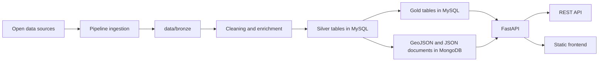

<<<<<<< HEAD
# Urban Data Explorer


Urban Data Explorer est une plateforme data locale pour explorer les dynamiques du logement a Paris. Le projet assemble des sources ouvertes heterogenes, les normalise dans un pipeline Bronze / Silver / Gold, puis les sert via FastAPI dans une interface cartographique interactive.

Le depot est pense comme un monorepo simple a faire evoluer: un pipeline batch, une API FastAPI, un frontend statique, un stockage `MySQL` pour les tables analytiques, et un stockage `MongoDB` pour les documents cartographiques et metadonnees.

## Sommaire

- [Pourquoi ce projet](#pourquoi-ce-projet)
- [Fonctionnalites](#fonctionnalites)
- [Architecture](#architecture)
- [Structure du depot](#structure-du-depot)
- [Demarrage rapide](#demarrage-rapide)
- [Sources de donnees](#sources-de-donnees)
- [Artefacts produits](#artefacts-produits)
- [API](#api)
- [Livrables](#livrables)
- [Documentation](#documentation)
- [Statut du projet](#statut-du-projet)

## Pourquoi ce projet

Le marche du logement parisien est documente par une multitude de jeux de donnees ouverts, mais ces sources restent dispersees, heterogenes et difficiles a croiser rapidement. Urban Data Explorer propose une couche d'unification operationnelle pour repondre a des questions comme:

- comment evoluent les prix de vente d'un arrondissement a l'autre
- combien de mois de revenu median sont necessaires pour acheter 1 m2
- comment se comparent loyers, revenus et production de logements sociaux
- quelle lecture environnementale associer a un secteur via l'air et le bruit
- que voit-on a une maille plus fine que l'arrondissement: quartier, rue, batiment proxy

## Fonctionnalites

- Pipeline data reproductible avec zones `Bronze`, `Silver` et `Gold`
- Croisement de plusieurs sources publiques: DVF, INSEE Filosofi, Paris Data, Bruitparif, BAN
- Cartographie multi-niveaux: `arrondissement`, `quartier`, `street`, `building`
- Vue de synthese ville + comparateur unique `arrondissement` / `quartier` + timeline locale
- Interface allegee centree sur la carte, les KPIs, les comparaisons et les tendances
- Geocodage des ventes via `adresses-ban` avec fallback `BAN Plus`
- API REST simple lisant les tables `Gold` dans `MySQL` et les documents `GeoJSON/JSON` dans `MongoDB`
- Frontend statique servi par FastAPI, donc zero bundle complexe a maintenir
- Environnement `Docker Compose` pour lancer rapidement `mysql`, `mongo`, `api` et le service `pipeline`

## Architecture



### Flux principal

1. Les sources ouvertes sont telechargees a partir de `config/sources.yaml`.
2. Le pipeline filtre, nettoie, geocode et enrichit les donnees.
3. Les sorties `Silver` et les tables `Gold` sont materialisees en SQL dans `MySQL`.
4. Les couches `GeoJSON` et les metadonnees du dashboard sont materialisees en documents `MongoDB`.
5. L'API FastAPI lit `MySQL` pour les indicateurs et `MongoDB` pour les documents cartographiques.
6. Le frontend JavaScript consomme directement l'API et affiche les cartes, classements et comparaisons.

## Structure du depot

```text
UrbanDataExplorer/
|- api/                  # API FastAPI et routes du dashboard
|- common/               # Helpers partages pour MySQL et MongoDB
|- config/               # Catalogue des sources ouvertes
|- data/                 # Zones bronze / silver / gold
|- docs/                 # Documentation fonctionnelle et technique
|- frontend/             # Interface HTML / CSS / JS servie par FastAPI
|- pipeline/             # Ingestion, nettoyage et build des artefacts
|- scripts/              # Scripts d'initialisation locale
|- docker-compose.yml    # Stack locale mysql + mongo + api + pipeline
`- README.md
```

## Demarrage rapide

### Prerequis

- acces reseau pour telecharger les sources ouvertes
- `Docker Desktop` pour le script de premier lancement
- `Python 3.11+` seulement si vous lancez le pipeline hors Docker

### Demarrage rapide apres un clone Git

Pour une premiere installation locale, le plus simple est d'utiliser le script Docker fourni:

```powershell
git clone <url-du-repo>
cd UrbanDataExplorer
.\scripts\first-run.ps1
```

Si PowerShell bloque l'execution des scripts:

```powershell
powershell -ExecutionPolicy Bypass -File .\scripts\first-run.ps1
```

Ce script:

- copie `.env.example` vers `.env` si besoin
- demarre `MySQL` et `MongoDB`
- construit l'image Docker du pipeline
- telecharge les datasets declares dans [`config/sources.yaml`](config/sources.yaml)
- lance le traitement `Bronze -> Silver -> Gold`
- valide les sorties chargees dans `MySQL` et `MongoDB`

Pour telecharger et traiter les donnees puis lancer aussi l'API:

```powershell
.\scripts\first-run.ps1 -StartApi
```

Options utiles:

- `-ForceDownload`: retelecharge les sources meme si elles existent deja localement
- `-SkipNoise`: evite le calcul Bruitparif, plus long, et utilise des valeurs environnementales neutres
- `-SkipValidate`: ignore la validation finale
- `-Sources dvf_2025_paris bruitparif_sig_2024`: ne telecharge que certaines sources configurees

### Installation manuelle

```powershell
python -m venv .venv
.\.venv\Scripts\Activate.ps1
pip install -r pipeline/requirements.txt -r api/requirements.txt
Copy-Item .env.example .env -ErrorAction SilentlyContinue
```

### 0. Demarrer MySQL et MongoDB avec Docker

```powershell
docker compose up -d mysql mongo
```

Par defaut, les bases sont exposees sur:

- MySQL: `localhost:3306`
- MongoDB: `localhost:27017`

Configuration utilisee par defaut:

- base SQL: `urban_data_explorer`
- utilisateur SQL: `urban`
- mot de passe SQL: `urban`
- base NoSQL: `urban_data_explorer`

### 1. Lister les sources configurees

```powershell
python pipeline/run_imports.py list
```

### 2. Telecharger les donnees brutes

```powershell
python pipeline/run_imports.py download
```

Ou via Docker:

```powershell
docker compose run --rm pipeline python pipeline/run_imports.py download
```

Sans argument, `download` recupere toutes les sources declarees dans [`config/sources.yaml`](config/sources.yaml).

Le depot GitHub est volontairement lean: les jeux de donnees `Bronze`, les tables SQL regenerees localement, les logs locaux et les artefacts bureautiques ne sont pas versionnes. Chaque utilisateur telecharge donc les sources ouvertes et regenere ses sorties localement.

### 3. Construire les sorties Silver / Gold dans MySQL et MongoDB

```powershell
python pipeline/run_imports.py build
```

Ou via Docker:

```powershell
docker compose run --rm pipeline python pipeline/run_imports.py build
```

Option utile pour un build plus rapide si vous ne voulez pas recalculer Bruitparif:

```powershell
python pipeline/run_imports.py build --skip-noise
```

Pour une execution complete et planifiable:

```powershell
python pipeline/run_imports.py run
```

Cette commande enchaine `download`, `build` et `validate`. Elle accepte aussi `--skip-download`, `--skip-build`, `--skip-validate`, `--force-download` et `--skip-noise`.

### 4. Lancer l'application

```powershell
docker compose up --build -d api
```

Ou en local hors Docker:

```powershell
$env:MYSQL_HOST="127.0.0.1"
$env:MYSQL_PORT="3306"
$env:MYSQL_DATABASE="urban_data_explorer"
$env:MYSQL_USER="urban"
$env:MYSQL_PASSWORD="urban"
$env:MONGO_HOST="127.0.0.1"
$env:MONGO_PORT="27017"
$env:MONGO_DATABASE="urban_data_explorer"
python -m uvicorn api.app.main:app --reload
```

Ouvrez ensuite `http://127.0.0.1:8000`.

### 5. Verifier que tout tourne

```powershell
Invoke-RestMethod http://127.0.0.1:8000/health
Invoke-RestMethod http://127.0.0.1:8000/api/meta
python pipeline/run_imports.py validate
python -m unittest discover -s tests
```

Si vous utilisez Docker, vous pouvez aussi verifier l'etat des services:

```powershell
docker compose ps
```

### 6. Arreter la stack

```powershell
docker compose down
```

## Sources de donnees

Le catalogue complet est maintenu dans [`config/sources.yaml`](config/sources.yaml). Les principales sources consommees par le build sont:

| Dataset | Role dans le projet | Maille principale |
| --- | --- | --- |
| `dvf_2023_paris`, `dvf_2024_paris`, `dvf_2025_paris` | Transactions immobilieres, prix au m2, volumes, surfaces, timeline | mutation / adresse |
| `insee_filosofi_2021` | Revenus, niveau de vie, part imposable, taux de pauvrete | IRIS |
| `paris_loyers` | Loyers de reference, majores et minores | quartier |
| `paris_social_housing` | Programmes et volumes de logements sociaux finances | arrondissement / programme |
| `bruitparif_sig_2024` | Scores air / bruit et pression environnementale | couche SIG |
| `reference_arrondissements` | Fond cartographique principal | arrondissement |
| `quartier_paris` | Aggregation fine des ventes et carte quartier | quartier |
| `voie_paris` | Representation lineaire des rues | rue |
| `adresses_ban` | Geocodage des ventes DVF | adresse |
| `iris_paris` | Rattachement spatial fin et sorties IRIS | IRIS |

Service complementaire utilise pendant le build:

- `BAN Plus - lien adresse parcelle`: [service WFS](https://data.geopf.fr/wfs/ows)

Source deja cataloguee mais non consommee par le build actuel:

- `bruitparif_stats_2024`

## Indicateur qualite de vie

Les signaux environnementaux issus de Bruitparif sont regroupes dans un indicateur composite unique expose dans le dashboard: `quality_of_life_score`.

Ce score est calcule sur `10`. Plus il est eleve, meilleure est la qualite de vie environnementale estimee.

### Composantes

- `noise_score`: intensite moyenne du bruit, ramenee en score favorable quand le bruit baisse
- `air_score`: pression moyenne liee a la qualite de l'air, ramenee en score favorable quand l'air s'ameliore
- `high_noise_share_pct`: part de surface exposee aux classes de bruit les plus elevees
- `environmental_pressure_index`: synthese intermediaire air + bruit, conservee comme signal de contexte

### Formule

```text
noise_norm = 1 - ((noise_score - 1) / 2)
air_norm = 1 - ((air_score - 1) / 2)
high_noise_norm = 1 - (high_noise_share_pct / 100)
env_norm = 1 - (environmental_pressure_index / 100)

quality_of_life_score = 10 * (
  0.30 * noise_norm +
  0.30 * air_norm +
  0.25 * high_noise_norm +
  0.15 * env_norm
)
```

### Pourquoi ces coefficients

- `0.30` pour `noise_norm`: le bruit ressenti au quotidien a un impact direct et immediat sur l'habitabilite d'un quartier
- `0.30` pour `air_norm`: la qualite de l'air est un facteur environnemental majeur, comparable en importance au bruit
- `0.25` pour `high_noise_norm`: la part de zones tres bruyantes capture l'exposition aux situations les plus degradantes, mais sur un angle plus localise
- `0.15` pour `env_norm`: l'indice de pression environnementale sert de signal de synthese, avec un poids plus faible pour eviter de compter deux fois des informations deja presentes dans `noise_score` et `air_score`

Les composantes detaillees restent conservees dans les sorties `Gold` pour auditabilite, mais l'interface utilisateur n'expose plus qu'un seul indicateur de lecture: `Qualite de vie`.

## Artefacts produits

Le pipeline produit plusieurs sorties exploitees par l'API et le dashboard, reparties entre `MySQL` et `MongoDB`:

| Stockage | Objet | Description |
| --- | --- | --- |
| `MySQL` | `gold_arrondissement_summary` | table de synthese principale pour les 20 arrondissements |
| `MySQL` | `gold_sales_yearly` | serie annuelle des indicateurs de ventes par arrondissement |
| `MySQL` | `gold_sales_quartier_yearly` | vue agregree par quartier administratif |
| `MySQL` | `gold_sales_iris_yearly` | vue agregree par IRIS |
| `MySQL` | `gold_sales_street_yearly` | vue agregree par rue |
| `MySQL` | `gold_sales_building_yearly` | vue agregree par batiment proxy / adresse |
| `MySQL` | `gold_sales_geocoded` | transactions geocodees et enrichies |
| `MongoDB` | `gold_arrondissements_geojson` | couche cartographique des arrondissements |
| `MongoDB` | `gold_quartiers_geojson` | couche cartographique des quartiers |
| `MongoDB` | `gold_streets_geojson` | couche cartographique des rues |
| `MongoDB` | `gold_iris_geojson` | couche cartographique des IRIS |
| `MongoDB` | `gold_dashboard_metadata` | metadonnees du dashboard, catalogue de metriques et annees disponibles |
| `MongoDB` | `gold_sales_spatial_coverage` | metriques de couverture spatiale du geocodage |

Le niveau `building` est un proxy d'adresse / batiment construit a partir de `cle_interop` BAN quand elle existe, avec repli sur la parcelle cadastrale puis sur une cle d'adresse normalisee.

## API

L'API lit directement `MySQL` pour les donnees tabulaires et `MongoDB` pour les documents, puis sert aussi le frontend statique.

### Endpoints principaux

| Endpoint | Usage |
| --- | --- |
| `GET /` | page d'accueil du dashboard |
| `GET /health` | verification du service et des connexions `MySQL` + `MongoDB` |
| `GET /sources` | catalogue des sources avec libelles, resumes et URLs |
| `GET /api/meta` | metriques disponibles, annees et niveaux cartographiques |
| `GET /api/overview?sales_year=2025` | synthese ville + donnees des arrondissements |
| `GET /api/timeline?arrondissement=11` | chronologie ventes / loyers / logement social |
| `GET /api/compare?left=11&right=18&sales_year=2025` | comparaison de deux arrondissements |
| `GET /api/quartiers?sales_year=2025` | liste des quartiers disponibles pour la comparaison fine |
| `GET /api/quartiers/compare?left=7510101&right=7510102&sales_year=2025` | comparaison de deux quartiers |
| `GET /api/map?metric=median_price_m2&level=arrondissement&year=2025` | couche cartographique pour une metrique |
| `GET /api/reference/quartier` | geometries de reference pour certains niveaux fins |

### Metriques exposees

Exemples de metriques disponibles dans le dashboard:

- `median_price_m2`
- `transactions`
- `median_sale_value_eur`
- `median_surface_m2`
- `median_rooms`
- `apartment_share_pct`
- `house_share_pct`
- `median_income_eur`
- `reference_rent_majorated_eur_m2`
- `social_units_financed`
- `social_units_financed_5y`
- `months_income_for_1sqm`
- `estimated_50m2_rent_effort_pct`
- `quality_of_life_score`
- `environmental_pressure_index`
- `high_noise_share_pct`
- `noise_score`
- `air_score`

Pour le detail des formules et du sens de chaque indicateur, voir [`docs/data-catalog.md`](docs/data-catalog.md).

## Livrables

Le repo couvre les 3 livrables principaux suivants:

1. Code source complet: `pipeline + API + frontend`
   Preuves: `pipeline/`, `api/`, `frontend/`
2. Documentation d'architecture et schemas data
   Preuve: [`docs/architecture.md`](docs/architecture.md)
3. Mini data catalog avec justification des sources et des choix
   Preuve: [`docs/data-catalog.md`](docs/data-catalog.md)

## Documentation

- [`docs/architecture.md`](docs/architecture.md): vue d'ensemble technique et logique Bronze / Silver / Gold
- [`docs/data-catalog.md`](docs/data-catalog.md): catalogue des sources et lecture des indicateurs
- [`pipeline/README.md`](pipeline/README.md): commandes du pipeline
- [`api/README.md`](api/README.md): lancement du backend
- [`frontend/README.md`](frontend/README.md): principes du frontend

## Statut du projet

Le projet est aujourd'hui structure comme un prototype data solide, local-first et facile a etendre:

- stack locale reproductible avec `Docker Compose`
- separation claire entre `MySQL` pour le tabulaire et `MongoDB` pour les documents
- couches `Gold` reconstruisibles localement a partir des sources `Bronze`
- architecture simple pour ajouter de nouvelles sources ou de nouvelles mailles cartographiques
- commande `validate` pour controler les sorties `Gold` apres build
- commande `run` pour enchainer `download`, `build` et `validate` dans une execution planifiee
- tests unitaires lancables avec `python -m unittest discover -s tests`
- metriques de qualite de vie enrichies et couverture spatiale exposee dans les metadonnees API
=======
# ArchitectureData-UrbanDataExplorer-
Projet Architecture Data
>>>>>>> c80214834d9232ccfe44196c6e6f1795652f2d18
