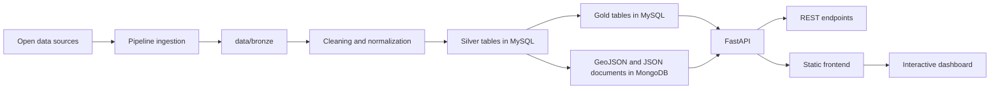
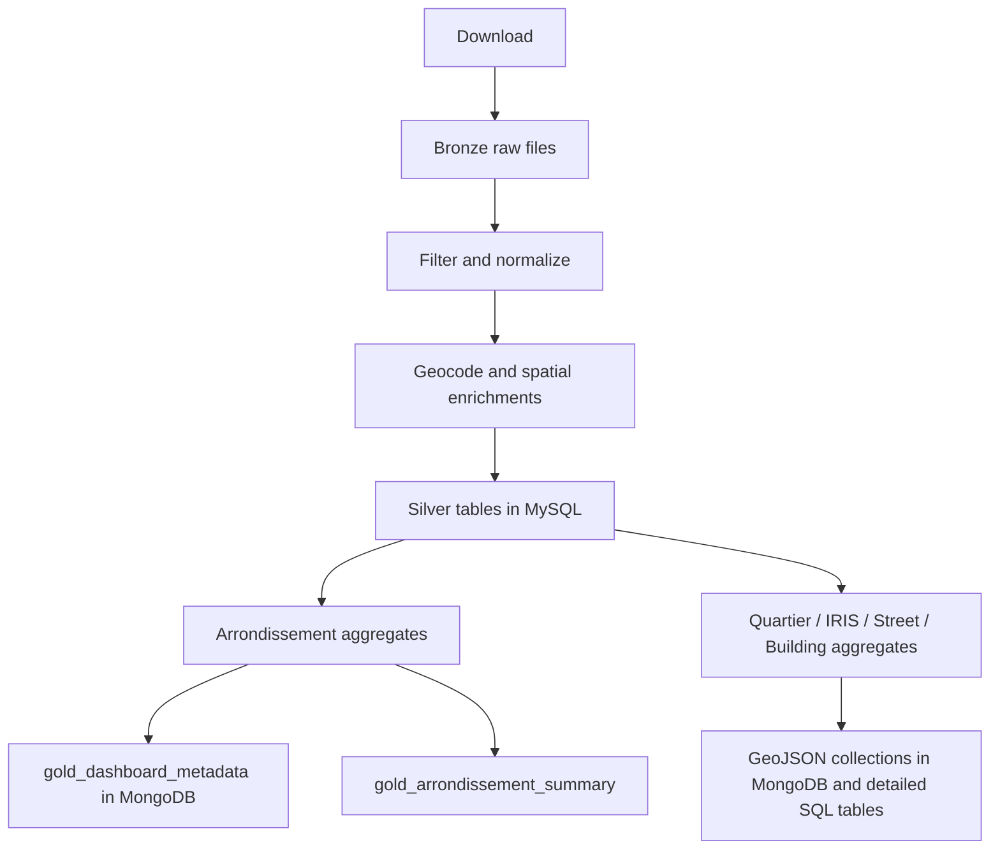
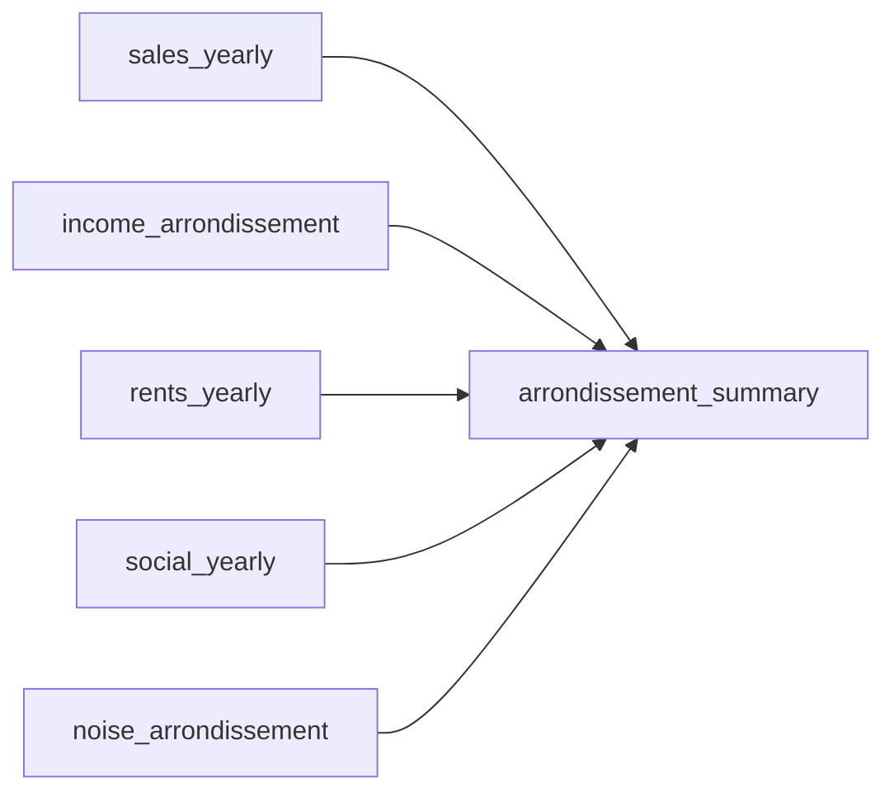

# Architecture

## Objectif

Urban Data Explorer est une application data locale-first qui transforme plusieurs sources ouvertes heterogenes en un dashboard web cohérent sur le logement parisien.

L'architecture poursuit quatre objectifs:

- isoler clairement l'ingestion, la transformation et l'exposition
- garder des sorties auditables et reutilisables avec un couple `MySQL` + `MongoDB`
- faciliter l'evolution vers de nouvelles mailles geographiques et nouvelles metriques
- permettre une demo fluide avec un frontend simple, rapide a lancer et a expliquer via `Docker Compose`

## Vue d'ensemble



## Composants

### 1. Pipeline

Responsabilite:

- telecharger les sources configurees dans `config/sources.yaml`
- filtrer et nettoyer les donnees brutes
- normaliser les variables de prix, surfaces, dates et identifiants geographiques
- enrichir les transactions par geocodage, quartier, IRIS, rue et batiment proxy
- produire les tables et couches `Silver` et `Gold`

Principaux fichiers:

- `pipeline/run_imports.py`
- `pipeline/src/urban_data_explorer/cli.py`
- `pipeline/src/urban_data_explorer/build.py`
- `pipeline/src/urban_data_explorer/validation.py`
- `pipeline/src/urban_data_explorer/ingestion/downloader.py`
- `pipeline/src/urban_data_explorer/distributed/` (calcul distribue Dask / Spark)
- `pipeline/src/urban_data_explorer/streaming/` (couche streaming temps reel Kafka)

#### Calcul distribue (C2.2)

L'etape d'agregation des ventes (`aggregate_sales_metrics`) est le coeur
calculatoire du pipeline. Elle dispose de trois moteurs interchangeables
produisant un resultat strictement identique : `pandas` (defaut, mono-machine),
`dask` (cluster Dask local) et `spark` (cluster Spark master + workers,
dockerise dans `docker-compose.spark.yml`). Le moteur se choisit via l'argument
`engine` ou la variable `UDE_AGG_ENGINE`. Voir
[`docs/distributed-computing.md`](distributed-computing.md) pour le detail, la
preuve d'equivalence et la lecture des performances.

#### Streaming temps reel et architecture Lambda (C2.2)

En complement de la couche batch, une couche streaming traite les nouvelles
ventes au fil de l'eau via Kafka (`docker-compose.kafka.yml`) : un producer
rejoue les transactions dans un topic, un consumer Python les agrege en temps
reel dans `stream_sales_yearly`. Batch et streaming produisent des agregats
identiques (meme logique d'agregation). Voir
[`docs/streaming-architecture.md`](streaming-architecture.md).

### 2. Stockage par zones, SQL et NoSQL

Responsabilite:

- `Bronze`: conserver les fichiers sources telecharges
- `Silver`: stocker les tables nettoyees et enrichies dans `MySQL`
- `Gold`: stocker les tables analytiques dans `MySQL`
- `Gold`: stocker les couches `GeoJSON` et metadonnees `JSON` dans `MongoDB`

Le projet conserve donc les sources ouvertes en fichiers pour la zone `Bronze`, puis materialise les datasets prepares dans deux stockages complementaires:

- `MySQL` pour les indicateurs tabulaires et relationnels
- `MongoDB` pour les documents cartographiques et metadonnees

### 3. API FastAPI

Responsabilite:

- lire les tables `Gold` depuis `MySQL`
- lire les documents `GeoJSON/JSON` depuis `MongoDB`
- exposer les endpoints du dashboard
- servir aussi les fichiers statiques du frontend

Principaux endpoints:

- `GET /health`
- `GET /sources`
- `GET /api/meta`
- `GET /api/overview`
- `GET /api/timeline`
- `GET /api/compare`
- `GET /api/quartiers`
- `GET /api/quartiers/compare`
- `GET /api/map`
- `GET /api/reference/{level}`

### 4. Frontend

Responsabilite:

- recuperer les donnees via l'API
- afficher la carte principale, les KPIs, un comparateur unique `arrondissement` / `quartier` et la timeline
- permettre une lecture multi-niveaux: `arrondissement`, `quartier`, `street`, `building`

Stack:

- `HTML`
- `CSS`
- `JavaScript`
- `MapLibre GL`
- interface servie directement par `FastAPI`

### 5. Validation et planification

Responsabilite:

- `python pipeline/run_imports.py validate` controle la presence des tables `Gold`, des colonnes attendues et des documents MongoDB
- `python pipeline/run_imports.py run` orchestre `download`, `build` et `validate` pour les executions planifiees
- `python -m unittest discover -s tests` couvre les fonctions de calcul, le CLI et les helpers de validation

## Organisation du depot

```text
UrbanDataExplorer/
|- api/
|  `- app/
|- common/
|- config/
|  `- sources.yaml
|- data/
|  |- bronze/
|  |- silver/
|  `- gold/
|- docs/
|- frontend/
|- pipeline/
|  `- src/urban_data_explorer/
`- README.md
```

## Cycle de vie de la data



## Modele de donnees simplifie



Le viewer Markdown de certains environnements affiche mal `erDiagram`, donc la version ci-dessus reste volontairement simple. Les champs principaux sont resumes ci-dessous.

| Jeu de donnees | Cle logique | Champs utiles |
| --- | --- | --- |
| `sales_yearly` | `arrondissement`, `year` | `median_price_m2`, `transactions`, `median_sale_value_eur`, `median_surface_m2`, `median_rooms`, `apartment_share_pct`, `house_share_pct` |
| `income_arrondissement` | `arrondissement` | `median_income_eur`, `poverty_rate_pct` |
| `rents_yearly` | `arrondissement`, `year` | `reference_rent_majorated_eur_m2` |
| `social_yearly` | `arrondissement`, `year` | `social_units_financed` |
| `noise_arrondissement` | `arrondissement` | `noise_score`, `air_score`, `high_noise_share_pct` |
| `arrondissement_summary` | `arrondissement` | `median_price_m2`, `median_income_eur`, `reference_rent_majorated_eur_m2`, `quality_of_life_score`, `environmental_pressure_index` |

## Niveaux geographiques servis

| Niveau | Usage | Sorties principales |
| --- | --- | --- |
| `arrondissement` | KPIs, comparaison, carte principale | `gold_arrondissement_summary`, `gold_arrondissements_geojson` |
| `quartier` | lecture plus fine du marche | `gold_sales_quartier_yearly`, `gold_quartiers_geojson` |
| `street` | lecture lineaire des voies | `gold_sales_street_yearly`, `gold_streets_geojson` |
| `building` | proxy d'adresse / batiment | `gold_sales_building_yearly`, `gold_sales_geocoded` |
| `IRIS` | enrichissements statistiques fins | `gold_sales_iris_yearly`, `gold_iris_geojson` |

Les niveaux `quartier`, `street` et `building` exposent sur la carte les metriques de vente disponibles a leur maille. Les indicateurs de contexte consolides, comme revenu, loyer, logement social et qualite de vie, restent servis au niveau `arrondissement`.

## Choix d'architecture

### Pourquoi MySQL et MongoDB

Le stockage mixte repond mieux au cadre pedagogique du projet:

- les datasets prepares sont bien stockes sous forme de tables SQL interrogeables
- les couches cartographiques et metadonnees sont stockees comme documents NoSQL
- l'API n'est plus couplee a des fichiers `CSV` ou `JSON` disperses
- `Docker Compose` simplifie le lancement de la base et de l'application

### Comment la separation est faite

- `MySQL` stocke les tables analytiques utilisees pour les KPIs, les comparaisons et les timelines
- `MongoDB` stocke les `FeatureCollection` cartographiques et les documents de metadonnees
- le pipeline ecrit dans les deux stockages pendant `build`
- l'API assemble ensuite les reponses en lisant chaque type de donnee dans le moteur le plus adapte

### Pourquoi FastAPI sert aussi le frontend

- une seule commande de lancement
- moins de friction en demo
- pas de reverse proxy supplementaire a expliquer

### Pourquoi plusieurs mailles spatiales

- l'arrondissement est lisible pour un public large
- le quartier et l'IRIS donnent plus de finesse analytique
- la rue et le batiment proxy rendent la demo plus visuelle et plus impressionnante

## Limites actuelles

- pas de deploiement public automatise dans le repo a ce stade
- le calcul distribue (Spark / Dask) est plus lent que pandas sur le volume
  actuel car les donnees tiennent en memoire : son interet est la scalabilite
  et la resilience, pas la vitesse a petite echelle (voir
  [`docs/distributed-computing.md`](distributed-computing.md))
- les datasets publics restent telecharges localement plutot que versionnes
- les calculs de qualite de vie reposent sur des ponderations explicites mais discutables

## Evolutions naturelles

- ajouter une CI pour verifier le pipeline et l'API
- industrialiser la regeneration des tables `Gold`
- brancher un stockage objet ou une base analytique si les volumes augmentent
- ajouter une strategie de deploiement public du dashboard avec jeux de test preconstruits
