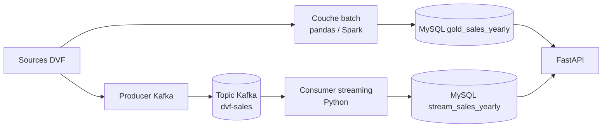

# Architecture Lambda : batch + streaming (competence C2.2)

Ce document decrit la couche streaming temps reel ajoutee a Urban Data Explorer,
qui complete la couche batch existante pour former une architecture Lambda.

## Le principe

Une architecture Lambda combine deux chemins de traitement qui alimentent la
meme couche de service :

- **couche batch** : recalcule l'historique complet de facon fiable et
  reproductible. C'est ton pipeline existant (`run_imports.py build`), avec le
  choix du moteur pandas / Spark distribue.
- **couche streaming** : traite les nouveaux evenements au fil de l'eau, avec
  une faible latence. C'est Kafka + un consumer Python.

Les deux ecrivent dans la couche de service (MySQL / Mongo), lue par l'API.



## Le sens metier

Le choix n'est pas gratuit, il colle a la realite de la donnee immobiliere :

- les bases DVF officielles sont **publiees par lots** (trimestriels) :
  c'est le travail de la couche batch ;
- une agence, un notaire ou une plateforme qui pousserait ses ventes **au fil
  de l'eau** justifie la couche streaming, avec un tableau de bord mis a jour en
  continu sans attendre le prochain build complet.

## Coherence batch / streaming

Point essentiel pour le jury : la couche streaming et la couche batch produisent
des agregats **strictement identiques** sur les memes donnees. Le consumer
reutilise exactement la fonction d'agregation du batch
(`aggregate_sales_metrics`). C'est verifie par un test automatise
(`tests/test_streaming_state.py`).

Detail technique honnete : les indicateurs incluent des **medianes**, qui ne
sont pas incrementales (impossible de mettre a jour une mediane sans conserver
l'historique des valeurs). Le consumer maintient donc un etat des transactions
recues et recalcule l'agregat a chaque fenetre. C'est un choix assume et correct
pour ce type d'indicateur.

## Composants

| Composant | Fichier | Role |
| --- | --- | --- |
| Producer | `pipeline/jobs/streaming/sales_producer.py` | rejoue les ventes DVF dans le topic Kafka |
| Consumer | `pipeline/jobs/streaming/sales_consumer.py` | traite le flux, ecrit `stream_sales_yearly` |
| Etat | `pipeline/src/urban_data_explorer/streaming/state.py` | accumulation + recalcul d'agregats |
| Config | `pipeline/src/urban_data_explorer/streaming/config.py` | parametres broker / topic |
| Broker | `docker-compose.kafka.yml` | Kafka en mode KRaft (sans Zookeeper) |

## Lancer la demo

```bash
# 1. Demarrer la stack de base + Kafka + le consumer
docker compose -f docker-compose.yml -f docker-compose.kafka.yml up -d \
  mysql mongo kafka sales-consumer

# 2. Envoyer un flux de ventes (producer ponctuel)
docker compose -f docker-compose.yml -f docker-compose.kafka.yml \
  run --rm sales-producer

# 3. Observer les agregats temps reel dans MySQL
#    table : stream_sales_yearly
```

### Demo locale sans Docker

```bash
pip install -r pipeline/requirements-distributed.txt   # inclut kafka-python

# Avec un Kafka local sur localhost:9092 :
UDE_KAFKA_BOOTSTRAP=localhost:9092 python pipeline/jobs/streaming/sales_consumer.py --window 50 &
UDE_KAFKA_BOOTSTRAP=localhost:9092 python pipeline/jobs/streaming/sales_producer.py --rate 20 --limit 2000
```

## Ce que ca apporte au referentiel

| Competence | Apport |
| --- | --- |
| C2.2 | la couche streaming complete la couche distribuee Spark : tu couvres distribue **et** streaming |
| C1.4 | Kafka + workers = scalabilite horizontale et resilience du traitement |
| C2.3 | un flux temps reel s'ajoute aux sources batch dans l'integration multi-sources |
| C2.4 | comparaison possible latence streaming vs debit batch |

## Argumentaire pour le jury

> Nous avons mis en place une architecture Lambda. La couche batch recalcule
> tout l'historique DVF de facon fiable, avec un moteur distribue Spark
> disponible. La couche streaming, avec Kafka et un consumer Python, traite les
> nouvelles ventes au fil de l'eau et met a jour un tableau temps reel. Les deux
> couches produisent des agregats identiques, ce que nous prouvons par un test
> automatise, car le streaming reutilise la meme logique d'agregation que le
> batch. Ce choix reflete la realite de la donnee immobiliere : publiee par lots
> officiels, mais potentiellement poussee en continu par des acteurs de terrain.
